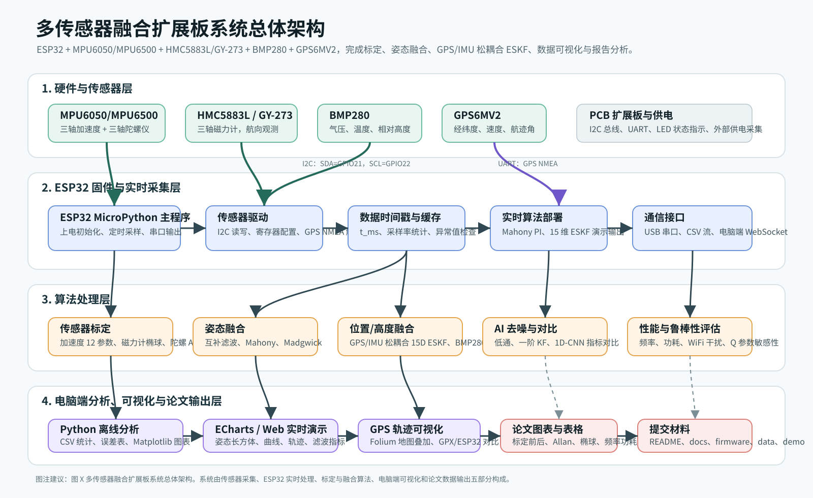

# 系统总体架构图说明

**图题：** 图 X  多传感器融合扩展板系统总体架构

**正文说明：**

本系统以 ESP32 为核心控制器，外接 MPU6050/MPU6500、HMC5883L/GY-273、BMP280 与 GPS6MV2 等传感器模块。其中 MPU6050/MPU6500、HMC5883L 与 BMP280 通过 I2C 总线接入 ESP32，GPS6MV2 通过 UART 输出 NMEA 定位数据。ESP32 端完成传感器初始化、寄存器配置、周期采样、时间戳记录、状态指示与串口数据输出，并部署 Mahony PI 与简化 15 维 ESKF 等实时算法用于演示。

电脑端 Python 程序负责离线数据处理、标定参数求解、算法对比和图表生成。标定模块包括加速度计六位置 12 参数仿射标定、磁力计椭球标定、陀螺仪 Allan 方差分析和 BMP280 气压高度分析；融合模块包括互补滤波、Mahony、Madgwick、GPS/IMU 松耦合 ESKF 与 BMP280 高度 Kalman 滤波；可视化模块包括 ECharts 实时姿态显示、roll/pitch/yaw 曲线、GPS 轨迹 Folium 叠加、标定前后误差对比和频率功耗统计。最终输出内容包括实验数据、分析图表、README、测试报告和课程论文正文。
