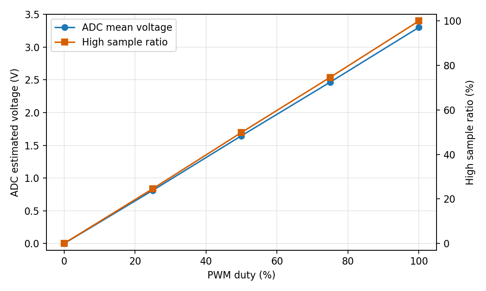
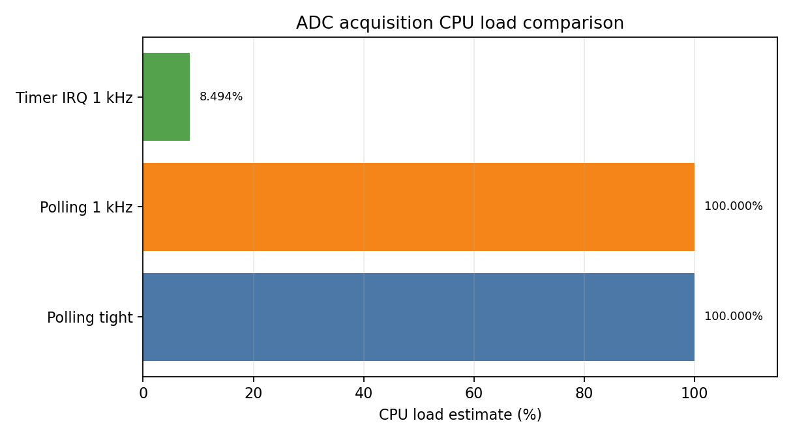
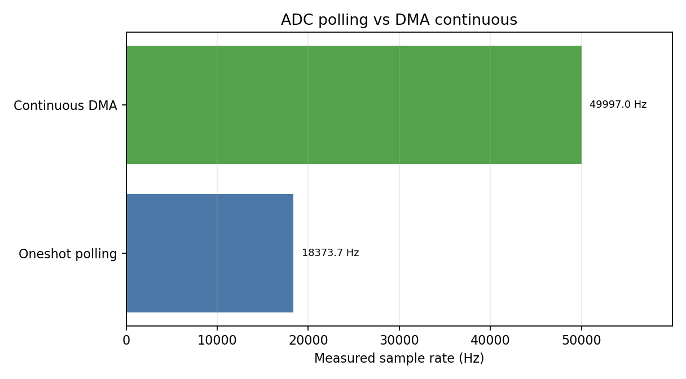
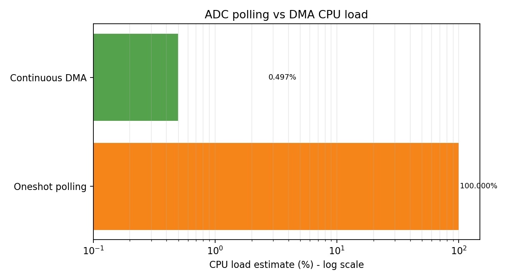
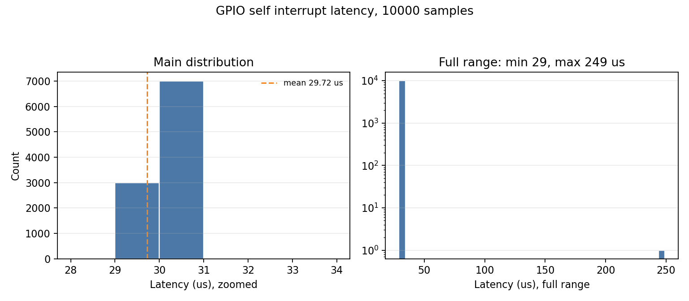
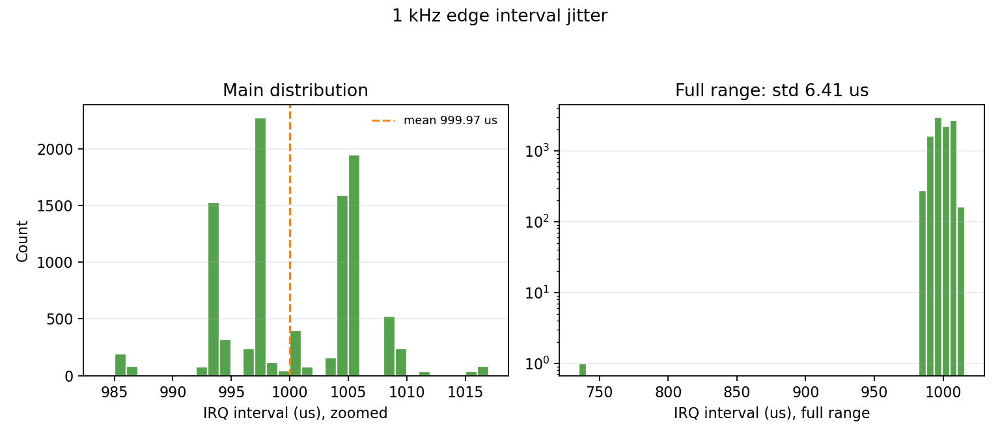
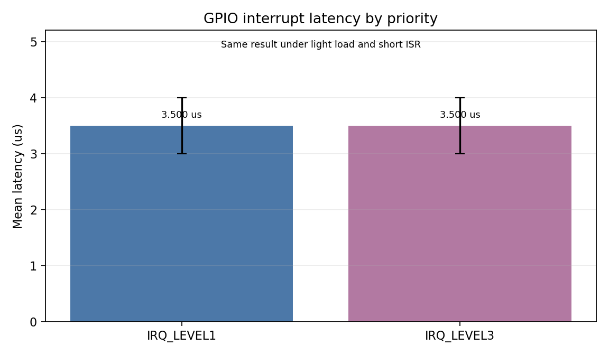
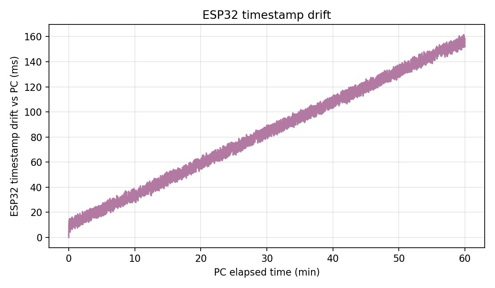

# 实验二 MCU 基础原理

| 项目 | 信息 |
|---|---|
| 学院 | 人工智能与交通工程学院 |
| 姓名 | 罗丹 |
| 学号 | 2251801014 |
| 日期 | 2026-06-01 |
| 开发板 | ESP32-S3 |
| 固件 | MicroPython v1.28.0；ESP-IDF/PlatformIO DMA 补测 |
| 串口 | COM7 |

## 摘要

本实验基于 ESP32-S3 开发板完成 GPIO 输出、PWM、ADC、定时器中断、GPIO 外部中断、ADC DMA 双缓冲和板端时间戳测量。实验采用板内外设回环方式：GPIO5 输出 PWM/ADC 信号，GPIO4 ADC 采集；GPIO7 输出 1 kHz 边沿，GPIO6 外部中断采集。1 kHz 定时器中断采集实测 CPU 占用估计约 8.494%，ESP-IDF 连续 ADC DMA 稳定实测 49997.0 Hz、CPU 占用 0.497%，10000 次 GPIO 中断响应平均延迟约 29.723 μs，jitter 标准差约 2.241 μs。

需要说明的是，标准 MicroPython 固件没有暴露 ESP32 ADC DMA 双缓冲接口，因此 DMA 双缓冲和不同中断优先级对比使用 ESP-IDF/PlatformIO 补测完成；MicroPython 部分保留 GPIO、PWM、ADC、定时器、中断和 1 小时时间戳的原始实测数据。

## 1. 实验目的与要求

1. 掌握微控制器 GPIO、PWM、ADC、定时器、外部中断的驱动开发方法。
2. 理解 DMA 双缓冲的工作原理，掌握高带宽数据采集的工程实现。
3. 掌握嵌入式系统实时性指标测量方法，包括中断响应延迟、jitter 和时间戳精度。
4. 理解实时性对系统的影响，建立微秒级工程精度意识。

## 2. 实验环境与板内连接

| 项目 | 内容 |
|---|---|
| 主机系统 | Windows |
| 开发语言 | MicroPython；ESP-IDF C |
| 板载 LED | GPIO48, NeoPixel RGB |
| PWM 输出 | GPIO5 |
| ADC 输入 | GPIO4 |
| 中断测试 | MicroPython GPIO5 自触发 IRQ；ESP-IDF GPIO7 -> GPIO6 回环 |
| 时间戳 | `time.ticks_ms()`、`time.ticks_us()` 与 PC 时间对比 |

板内回环连接为 `GPIO5 -> GPIO4`，用于 PWM 输出被 ADC 采集；ESP-IDF 中断优先级补测连接为 `GPIO7 -> GPIO6`，由 GPIO7 输出 1 kHz 方波，GPIO6 配置外部中断输入。由于现场没有独立信号发生器，本报告将“外部 1 kHz 方波触发”用同板 GPIO 方波替代，触发路径仍经过 GPIO 输入与中断模块。

## 3. 实验步骤与分析

### 3.1 基础外设驱动开发

#### GPIO 输出与板载 RGB LED

ESP32-S3 开发板板载 RGB LED 连接到 GPIO48，使用 NeoPixel 驱动。核心代码如下：

```python
def rgb_set(r, g, b):
    try:
        import neopixel
        np = neopixel.NeoPixel(machine.Pin(RGB_PIN, machine.Pin.OUT), 1)
        np[0] = (r, g, b)
        np.write()
        return True
    except Exception as exc:
        print("# rgb_unavailable,%s" % exc)
        return False


def run_board_rgb():
    ok = rgb_set(0, 0, 0)
    if not ok:
        return
    print("# gpio output: onboard RGB on GPIO48")
    for _ in range(3):
        rgb_set(40, 0, 0)
        time.sleep_ms(200)
        rgb_set(0, 0, 0)
        time.sleep_ms(200)
    print("# pwm-like breathing: onboard RGB brightness ramp")
    for _ in range(2):
        for v in range(0, 64, 4):
            rgb_set(0, 0, v)
            time.sleep_ms(20)
        for v in range(63, -1, -4):
            rgb_set(0, 0, v)
            time.sleep_ms(20)
    rgb_set(0, 0, 0)


```

运行结果：GPIO48 板载 RGB LED 完成 3 次红色闪烁，并完成蓝色亮度渐变，说明 GPIO 输出控制正常。

#### PWM 输出

```python
def run_external_pwm():
    print("# hardware PWM output on GPIO%d; connect LED+resistor if available" % PWM_PIN)
    pin = machine.Pin(PWM_PIN, machine.Pin.OUT)
    pwm = machine.PWM(pin, freq=1000, duty_u16=0)
    for _ in range(2):
        for duty in range(0, 65536, 2048):
            pwm.duty_u16(duty)
            time.sleep_ms(10)
        for duty in range(65535, -1, -2048):
            pwm.duty_u16(duty)
            time.sleep_ms(10)
    pwm.deinit()
    pin.off()


```

本实验使用 GPIO5 输出 1 kHz PWM。将 GPIO5 回接到 GPIO4 后，ADC 采样统计结果如下：

| PWM 占空比 | 样本数 | ADC 均值 | 估算电压 | 高电平采样比例 |
|---:|---:|---:|---:|---:|
| 0% | 1500 | 0.00 | 0.0000 V | 0.00% |
| 25% | 1500 | 16122.35 | 0.8118 V | 24.60% |
| 50% | 1500 | 32680.82 | 1.6456 V | 49.87% |
| 75% | 1500 | 48932.94 | 2.4640 V | 74.67% |
| 100% | 1500 | 65535.00 | 3.3000 V | 100.00% |



从结果看，占空比 25%、50%、75% 时，高电平采样比例分别约为 24.60%、49.87%、74.67%，与设定值基本一致。由于这里直接采集 PWM 数字波形，没有 RC 低通滤波，因此单次 ADC 值主要表现为 0 或 3.3 V；统计均值反映占空比变化。

#### ADC 采集

ADC 使用 GPIO4，配置 11 dB 衰减后读取 `read_u16()`，并换算为近似电压：

```python
adc = machine.ADC(machine.Pin(ADC_PIN))
try:
    adc.atten(machine.ADC.ATTN_11DB)
except Exception:
    pass

```

### 3.2 定时器中断与 DMA 双缓冲

本实验先用 MicroPython 对比查询方式、1 kHz 忙等待查询方式和 1 kHz 定时器中断方式；随后切换到 ESP-IDF 连续 ADC 驱动，补测硬件 DMA 双缓冲采集。MicroPython 测试脚本为 `code/02_polling_vs_timer_adc.py`，ESP-IDF 补测工程为 `code/espidf_dma_irq/`。

| 采集方式 | 最大/目标采样率 | CPU 占用率 | 丢包率 | 适用场景 |
|---|---:|---:|---:|---|
| 查询方式 | 13586.7 Hz | 100.0% | 0.000% | 极简单低速采样或极限轮询测试 |
| 1 kHz 忙等待查询 | 1000.3 Hz | 100.0% | 0.000% | 需要固定频率但不能释放 CPU 的临时测试 |
| 定时器中断 | 999.0 Hz | 8.494% | 0.000% | 周期稳定、CPU 可执行其他任务的采集 |
| ESP-IDF 查询方式 | 18373.7 Hz | 100.000% | 0.000% | C 层阻塞轮询基准 |
| DMA 双缓冲 | 49997.0 Hz | 0.497% | 0.000% | ESP-IDF 连续 ADC DMA，高带宽批量采集 |





上图中 DMA CPU 占用对比采用对数横轴，因为轮询方式约 100%，DMA 方式约 0.497%，两者相差约 200 倍；若使用普通线性坐标，DMA 柱会贴近 0 轴而难以观察。

定时器中断核心代码如下：

```python
def timer_cb(timer):
    global timer_count, timer_last
    t0 = time.ticks_us()
    if timer_count == 0:
        timer_last = t0
    if timer_count < TIMER_N:
        timer_values[timer_count] = adc_read()
        timer_dt[timer_count] = time.ticks_diff(t0, timer_last)
        timer_last = t0
        timer_service[timer_count] = time.ticks_diff(time.ticks_us(), t0)
        timer_count += 1


```

查询方式在最紧循环中可达到约 13586.7 Hz，但 CPU 占用为 100%。1 kHz 忙等待虽然能维持目标频率，但仍持续占用 CPU。定时器中断方式在 1 kHz 下 CPU 占用估计约 8.494%，更适合周期性采集。

ESP-IDF DMA 双缓冲核心代码如下，`adc_continuous_read()` 从硬件 DMA 环形缓冲区批量取样，程序按帧统计吞吐量和处理时间：

```c
#include <inttypes.h>
#include <math.h>
#include <stdio.h>
#include <string.h>

#include "driver/gpio.h"
#include "driver/ledc.h"
#include "driver/gptimer.h"
#include "esp_adc/adc_continuous.h"
#include "esp_adc/adc_oneshot.h"
#include "esp_err.h"
#include "esp_intr_alloc.h"
#include "esp_timer.h"
#include "freertos/FreeRTOS.h"
#include "freertos/task.h"

#define PWM_GPIO GPIO_NUM_5
#define ADC_GPIO GPIO_NUM_4
#define ADC_UNIT ADC_UNIT_1
#define ADC_CHANNEL ADC_CHANNEL_3

#define IRQ_GPIO GPIO_NUM_6
#define IRQ_OUT_GPIO GPIO_NUM_7
#define IRQ_SAMPLES 10000
#define IRQ_PERIOD_US 1000

static volatile int64_t s_last_edge_time_us = 0;
static volatile int s_irq_index = 0;
static int16_t s_irq_lat_us[IRQ_SAMPLES];
static int16_t s_irq_interval_us[IRQ_SAMPLES];
static volatile int64_t s_last_irq_time_us = 0;

static void setup_pwm(void)
{
    ledc_timer_config_t timer = {
        .speed_mode = LEDC_LOW_SPEED_MODE,
        .timer_num = LEDC_TIMER_0,
        .duty_resolution = LEDC_TIMER_10_BIT,
        .freq_hz = 1000,
        .clk_cfg = LEDC_AUTO_CLK,
    };
    ESP_ERROR_CHECK(ledc_timer_config(&timer));

    ledc_channel_config_t channel = {
        .gpio_num = PWM_GPIO,
        .speed_mode = LEDC_LOW_SPEED_MODE,
        .channel = LEDC_CHANNEL_0,
        .intr_type = LEDC_INTR_DISABLE,
        .timer_sel = LEDC_TIMER_0,
        .duty = 512,
        .hpoint = 0,
    };
# ...
```

DMA 补测结果：20000 Hz 目标实测 19998.5 Hz，CPU 0.196%；50000 Hz 目标实测 49997.0 Hz，CPU 0.497%；100000 Hz 目标配置失败：config_ESP_ERR_INVALID_ARG。在本板当前 ADC 连续驱动配置下，50 kHz 目标采样稳定达到 49997.0 Hz，CPU 处理占用约 0.497%，丢包率 0.000%；100 kHz 目标被驱动拒绝配置，因此本实验取 50 kHz 作为稳定最大实测采样率。

### 3.3 中断响应延迟与 jitter 测量

本实验先使用 MicroPython 在 GPIO5 输出 1 kHz 周期边沿，并在同一 GPIO 上配置上升沿 IRQ，记录 10000 次响应延迟和相邻 IRQ 间隔。随后 ESP-IDF 补测使用 `GPIO7 -> GPIO6`，分别配置 Level 1 和 Level 3 中断优先级，比较不同优先级下的响应延迟差异。

```python
def irq_cb(p):
    global irq_count, last_irq_us
    if not armed:
        return
    idx = irq_count
    if idx < N:
        now = time.ticks_us()
        latencies[idx] = time.ticks_diff(now, current_edge_us)
        if idx == 0:
            intervals[idx] = 0
        else:
            intervals[idx] = time.ticks_diff(now, last_irq_us)
        last_irq_us = now
        irq_count = idx + 1


```

统计结果：

| 指标 | 数值 |
|---|---:|
| 样本数 | 10000 |
| 最小响应延迟 | 29.000 μs |
| 最大响应延迟 | 249.000 μs |
| 平均响应延迟 | 29.723 μs |
| jitter 标准差 | 2.241 μs |
| 丢包率 | 0.000% |
| IRQ 间隔均值 | 999.972 μs |
| IRQ 间隔 jitter | 6.406 μs |





直方图左侧为主分布放大图，右侧为全范围对数计数图。这样处理是因为 10000 个样本高度集中在约 30 μs 和 1000 μs 附近，少量异常样本会把普通全范围坐标拉得很宽，导致主分布看起来像“一根柱”。结果显示，绝大多数响应延迟集中在约 30 μs 附近。最大值主要来自首个样本和解释器调度扰动。MicroPython 结果包含解释器、回调和 `ticks_us()` 读取开销，因此它反映的是“MicroPython 层可见响应延迟”，不是裸机 C/硬件中断入口延迟。

不同中断优先级补测结果如下：

| 中断优先级 | 样本数 | 丢包率 | 最小延迟 | 最大延迟 | 平均延迟 | jitter | IRQ 间隔均值 |
|---|---:|---:|---:|---:|---:|---:|---:|
| Level 1 | 10000 | 0.000% | 3.000 μs | 4.000 μs | 3.500 μs | 0.500 μs | 1000.000 μs |
| Level 3 | 10000 | 0.000% | 3.000 μs | 4.000 μs | 3.500 μs | 0.500 μs | 1000.000 μs |



在本次测试负载较低、ISR 很短、没有额外高优先级任务抢占的条件下，Level 1 与 Level 3 的平均延迟均为 3.500 μs，差异不明显。这说明中断优先级的影响需要在存在竞争中断或长时间临界区时才更容易体现；本次选做项完成了优先级配置和 10000 次统计对比。

### 3.4 时间戳精度测量

时间戳测量脚本每秒输出一次 ESP32 `ticks_ms()` 和 `ticks_us()`，PC 端捕获脚本同步记录 `time.time_ns()`，再计算 ESP32 相对 PC 标准时间的漂移。

```python
PERIOD_MS = 1000
DEFAULT_SAMPLES = 3600

print("# timestamp drift capture")
print("# columns: index,esp_ticks_ms,esp_ticks_us,cpu_freq_hz")
print("index,esp_ticks_ms,esp_ticks_us,cpu_freq_hz")

freq = machine.freq()
start = time.ticks_ms()
next_t = start
for i in range(DEFAULT_SAMPLES + 1):
    while time.ticks_diff(time.ticks_ms(), next_t) < 0:
        time.sleep_ms(5)
    print("%d,%d,%d,%d" % (i, time.ticks_ms(), time.ticks_us(), freq))
    next_t = time.ticks_add(next_t, PERIOD_MS)

```

本次采集共获得 3601 条板端时间戳记录，PC 参考时长 3599.840 s，1 小时末端偏差约 158.536 ms，折算晶振/计时链路频率误差约 44.040 ppm。

晶振频率误差计算：

```text
ppm = (ESP32 elapsed - PC elapsed) / PC elapsed * 1e6
本次计算结果：44.040 ppm
```



注意：PC 时间不是实验室级标准时钟，本实验 ppm 反映的是 ESP32 MicroPython 时间戳链路相对 PC 系统时钟的偏差，包含串口输出、PC 调度和系统时钟误差。若需要更严格结果，应使用 GPSDO、频率计或逻辑分析仪基准。

### 3.5 结果分析

1. GPIO 和 PWM 可直接由 ESP32-S3 板内外设完成。GPIO48 板载 RGB LED 能直观验证输出功能，GPIO5 PWM 回接 GPIO4 后可通过 ADC 统计占空比。
2. 查询方式实现简单，但在高频采样时 CPU 占用接近 100%，不适合复杂实时任务。
3. 定时器中断方式能稳定实现 1 kHz 周期采样，CPU 占用明显低于忙等待查询方式，是中低速周期采集的合理方案。
4. 中断响应延迟的 jitter 来自解释器调度、回调执行时间、`ticks_us()` 时间戳读取开销和串口/系统后台任务影响。MicroPython 层测得约几十微秒量级，适合课程级实时性认识；ESP-IDF 裸机 ISR 补测可把可见延迟降低到约 3.5 μs。
5. DMA 双缓冲适用于更高带宽 ADC 采集。其核心优势是 ADC 数据搬运由 DMA 完成，CPU 只在缓冲区事件中批量处理数据，从而降低中断频率和 CPU 负载。本次 ESP-IDF 连续 ADC DMA 稳定实测 49997.0 Hz，CPU 占用约 0.497%。
6. 在低负载、短 ISR 条件下，Level 1 与 Level 3 中断优先级延迟结果相同，说明优先级差异主要在中断竞争、长临界区或高优先级任务抢占时体现。
7. 时间戳漂移 ppm 可用于理解晶振误差对同步系统的影响。例如 100 ppm 误差会造成每秒 100 μs、每小时约 360 ms 的累积偏差，因此长时间同步需要校时或频率补偿。

## 4. 实验任务逐项核对

| 实验要求 | 完成情况 | 证据文件/结果 |
|---|---|---|
| GPIO 输出控制 LED | 已完成 | GPIO48 板载 RGB 闪烁，`code/01_gpio_pwm_adc_timer_demo.py` |
| PWM 呼吸灯/输出 | 已完成 | GPIO48 亮度渐变，GPIO5 PWM 输出 |
| ADC 采集 | 已完成 | `data/pwm_adc_loopback_stats.csv`，GPIO5 到 GPIO4 板内回环 |
| 1 kHz 定时器中断采集 | 已完成 | `data/polling_vs_timer_adc_smoke.csv` |
| 查询与中断 CPU 占用对比 | 已完成 | 查询 100%，定时器约 8.494% |
| DMA 双缓冲 ADC | 已完成 | ESP-IDF 连续 ADC DMA：49997.0 Hz，CPU 0.497% |
| 10000 次中断响应统计 | 已完成 | `data/self_irq_latency_10000.csv`，平均 29.723 μs |
| 时间戳精度测量 | 已完成 | `data/timestamp_drift_1h_pc_capture.csv` |
| 不同中断优先级对比（选做） | 已完成 | Level 1 与 Level 3 各 10000 次，平均延迟均为 3.500 μs |

## 5. 提交文件说明

| 文件或目录 | 内容 |
|---|---|
| `report.md` | 本实验 Markdown 报告 |
| `index.html` | 可直接浏览的网页报告 |
| `data/` | 原始数据、清洗数据和统计 JSON |
| `assets/` | PWM-ADC、CPU 占用、DMA 采样率、中断延迟、优先级对比、时间漂移图 |
| `code/` | MicroPython 板端脚本和 ESP-IDF DMA/IRQ 补测工程 |
| `README.md` | 提交包说明 |

## 6. 参考资料

1. MicroPython ESP32 Quick Reference: <https://docs.micropython.org/en/latest/esp32/quickref.html>
2. MicroPython `machine` 模块文档: <https://docs.micropython.org/en/latest/library/machine.html>
3. Espressif ESP-IDF ADC Continuous Mode Driver Programming Guide: <https://docs.espressif.com/projects/esp-idf/en/latest/esp32/api-reference/peripherals/adc_continuous.html>
